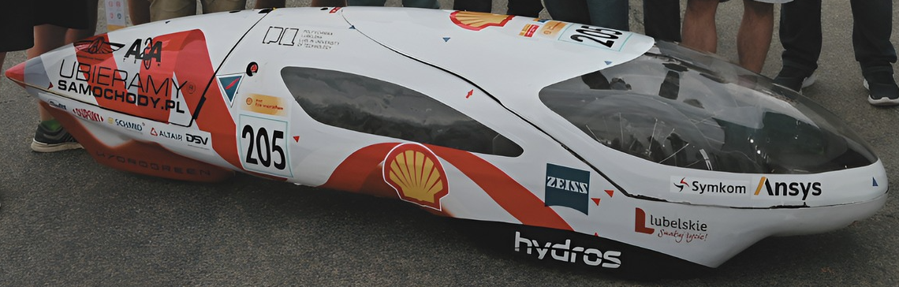

## Hydrogreen Pollub
Hydros is a prototype of an innovative three-wheeled vehicle equipped with an electric drive and **hydrogen** fuel cell. The vehicle has been designed to minimize energy losses through its aerodynamic body, incredibly low mechanical resistance, and a highly efficient drive system. The construction is based on a monocoque made of modern lightweight composite materials.

The project's goal is to participate and podium in the Shell Eco Marathon competitions. The Shell Eco Marathon competitions take place annually on three continents - Europe, America, and Asia. Shell Eco-Marathon is an event that brings together the worlds of science, technology, and industry in a competition where vehicle efficiency in terms of energy consumption is paramount.

    
    

## Current projects
- [Fuel cylinder unit PCB](https://github.com/HydrogreenPollub/fuel-cell-pcb)

## Legacy projects
- [Master controller](https://github.com/HydrogreenPollub/master-controller-stm32) - STM32 MCU that governs all PCBs telling them what is the current situation of the vehicle
- [Energy flow](https://github.com/HydrogreenPollub/energy-flow-stm32) - STM32 MCU taking care about energy flow from fuell cell and supercapacitor to motor controller
- [Telemetry](https://github.com/HydrogreenPollub/telemetry-esp32) - ESP32 MCU pushing data to our GIT stack (Grafana, InfluxDB, Telegraf)
- [Steering wheel controller](https://github.com/HydrogreenPollub/steering-wheel-stm32) - STM32 MCU taking input from buttons and swiches on steering wheel, as well as providing data to HMI panel
