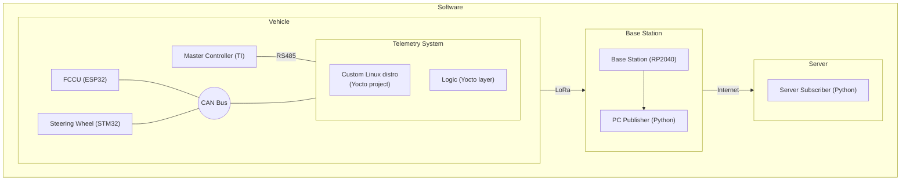

# Hydrogreen Team
*Hydrogreen Team* is a science club based at the Lublin University of Technology. It focuses on creating hydrogen-powered vehicles and, since its creation, has developed two vehicles: *Hydros* and *Hydra*.

*Hydros* is a prototype of an innovative three-wheeled vehicle equipped with an electric drive and **hydrogen** fuel cell. The vehicle has been designed to minimize energy losses through its aerodynamic body, incredibly low mechanical resistance, and a highly efficient drive system. The construction is based on a monocoque made of modern lightweight composite materials.

The project's goal is to participate and podium in the Shell Eco Marathon competitions. The Shell Eco Marathon competitions take place annually on three continents - Europe, America, and Asia. Shell Eco-Marathon is an event that brings together the worlds of science, technology, and industry in a competition where vehicle efficiency in terms of energy consumption is paramount.

    
    

## On-Vehicle Systems
- [esp32-fccu](https://github.com/HydrogreenPollub/esp32-fuel-cell-control-unit) - fuel cell control unit
- [stm32-swu](https://github.com/HydrogreenPollub/stm32-steering-wheel-unit) - steering wheel unit
- [rp4-yocto](https://github.com/HydrogreenPollub/rp4-yocto) - custom Linux distribution for telemetry system based on RP4 and Yocto
- [rp4-telemetry](https://github.com/HydrogreenPollub/rp4-telemetry) - telemetry system with LoRa, CAN and SD card support
- [ti-mcu](https://github.com/HydrogreenPollub/tm4c-master-control-unit) - master control unit based on Texas Instrument microcontroller

## Desktop & Cloud Tools
- [rp2040-base-station](https://github.com/HydrogreenPollub/rp2040-base-station) - LoRa receiver
- [pc-mqtt-publisher](https://github.com/HydrogreenPollub/pc-mqtt-publisher) - telemetry publisher on PC
- [server-mqtt-subscriber](https://github.com/HydrogreenPollub/server-mqtt-subscriber) - telemetry subscriber on server

```mermaid
flowchart TD
 subgraph SERVER["Server"]
        G["Server Subscriber (Python)"]
  end
 subgraph BASE["Base Station"]
        n4["Base Station (RP2040)"]
        n7["PC Publisher (Python)"]
  end
 subgraph s1["Telemetry System"]
        n6["Custom Linux distro<br>(Yocto project)"]
        n5["Logic (Yocto layer)"]
  end
 subgraph VEHICLE["Vehicle"]
    direction LR
        s1
        A["Master Controller (TI)"]
        B["FCCU (ESP32)"]
        n2["Steering Wheel (STM32)"]
        n3(("CAN Bus"))
  end
 subgraph s2["Software"]
        SERVER
        BASE
        VEHICLE
  end
    VEHICLE -- LoRa <br> --> BASE
    BASE -- Internet </br> --> SERVER
    n4 --> n7
    A -- RS485 --- s1
    B --- n3
    n2 --- n3
    n3 --- s1
	
    click G "https://github.com/HydrogreenPollub/server-mqtt-subscriber";
    click n6 "https://github.com/HydrogreenPollub/rp4-yocto";
    click n5 "https://github.com/HydrogreenPollub/rp4-telemetry";
    click n2 "https://github.com/HydrogreenPollub/stm32-steering-wheel-unit";
    click A "https://github.com/HydrogreenPollub/tm4c-master-control-unit";
    click B "https://github.com/HydrogreenPollub/esp32-fuel-cell-control-unit";
    click n4 "https://github.com/HydrogreenPollub/rp2040-base-station";
    click n7 "https://github.com/HydrogreenPollub/pc-mqtt-publisher";
```

## Current PCB projects
- [Master](https://github.com/HydrogreenPollub/master-pcb) - Master - measurment and safety unit PCB
- [FCCUv2](https://github.com/HydrogreenPollub/fccu_v2-pcb) - Fuel cell control unit v2 PCB
- [DCU](In progress) - Dual converter unit with fuel cell control PCB
- [FCM](In progress) - Fuel cell module - Current control and FC short PCB
- [LED_module]
- Telemetry unit PCB (*in future*)

## 2024 PCB projects
- [EFU](https://github.com/HydrogreenPollub/energy-flow-pcb) - Energy flow unit PCB
- [FCCU](https://github.com/HydrogreenPollub/fuel-cell-pcb) - Fuel cell control unit PCB
- [HCU](https://github.com/HydrogreenPollub/hydrogen-cylinder-pcb) - Hydrogen cylinder unit PCB
- [MCU](https://github.com/HydrogreenPollub/motor-driver-pcb) - Motor control unit PCB

- [KiCAD symbol library](https://github.com/HydrogreenPollub/symbol-library-kicad)
- [PCB template](https://github.com/HydrogreenPollub/template-pcb)

## 2024 software projects
- [Energy flow unit_test](https://github.com/HydrogreenPollub/EFU_test_code)
- [Energy flow](https://github.com/HydrogreenPollub/energy-flow-esp32)
- [Fuel cell](https://github.com/HydrogreenPollub/fuel-cell-esp32)
- [Hydrogen cylinder](https://github.com/HydrogreenPollub/hydrogen-cylinder-esp32)
- [Motor control](https://github.com/HydrogreenPollub/motor-control-esp32)
- [Telemetry](https://github.com/HydrogreenPollub/telemetry-esp32) - ESP32 MCU sending data to our GIT stack (Grafana, InfluxDB, Telegraf)

## 2020-2022 Legacy software projects
- [Master](https://github.com/HydrogreenPollub/master-controller-stm32) - STM32 MCU that governs all PCBs telling them what is the current situation of the vehicle
- [Energy flow](https://github.com/HydrogreenPollub/energy-flow-stm32) - STM32 MCU taking care of energy flow from fuell cell and supercapacitor to motor controller
- [Steering wheel](https://github.com/HydrogreenPollub/steering-wheel-stm32) - STM32 MCU taking input from buttons and swiches on steering wheel, as well as providing data to HMI panel
- [Test vehicle](https://github.com/HydrogreenPollub/test-vehicle-esp32) - ESP32 MCU for a simple test vehicle control
