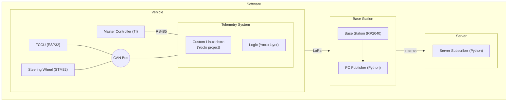

# Hydrogreen Team
*Hydrogreen Team* is a science club based at the Lublin University of Technology. It focuses on creating hydrogen-powered vehicles and, since its creation, has developed two vehicles: *Hydros* and *Hydra*.

*Hydros* is a prototype of an innovative three-wheeled vehicle equipped with an electric drive and **hydrogen** fuel cell. The vehicle has been designed to minimize energy losses through its aerodynamic body, incredibly low mechanical resistance, and a highly efficient drive system. The construction is based on a monocoque made of modern lightweight composite materials.

The project's goal is to participate and podium in the Shell Eco Marathon competitions. The Shell Eco Marathon competitions take place annually on three continents - Europe, America, and Asia. Shell Eco-Marathon is an event that brings together the worlds of science, technology, and industry in a competition where vehicle efficiency in terms of energy consumption is paramount.

    
    

## Vehicle systems (hardware & software)

We are migrating our core vehicle control systems to Zephyr RTOS for better modularity and reliability. To set up the complete development environment with all firmware repositories, use the [Zephyr manifest](https://github.com/HydrogreenPollub/zephyr-manifest).

* 🧠 Master control unit (MCU) · [PCB](https://github.com/HydrogreenPollub/pcb-master-controller-unit) · [Firmware](https://github.com/HydrogreenPollub/tm4c-master-control-unit) · [SCADE model](https://github.com/HydrogreenPollub/scade-master-control-unit)
    Central vehicle computer based on TI TM4C. Handles safety logic and state management.

* 🔋 Fuel cell control unit (FCCU) · [PCB](https://github.com/HydrogreenPollub/pcb-fuel-cell-control) · [Firmware](https://github.com/HydrogreenPollub/zephyr-fuel-cell-control-unit) 
    Logic and regulation for the hydrogen stack.

* ⚡ Fuel cell module (FCM) · [PCB](https://github.com/HydrogreenPollub/pcb-fuel-cell-module)
    Power stage and current control for the fuel cell stack.
  
* 🔌 Power distribution unit (PDU) · [PCB](https://github.com/mbagietson/BorkConnect)
    Power stage and current control for the fuel cell stack.

* 🏎️ Steering wheel unit (SWU) · [PCB](https://github.com/HydrogreenPollub/pcb-stm32-steering-wheel-v2) · [Firmware](https://github.com/HydrogreenPollub/zephyr-steering-wheel)
    Driver interface and HMI logic. Manages steering wheel buttons, the dead man's switch, and cockpit displays.

* 🔄 Can converter unit (CCU) · [PCB](https://github.com/HydrogreenPollub/stm32-can-converter-unit) · [Firmware](https://github.com/HydrogreenPollub/zephyr-can-converter-unit)
    Signal translation bridge for vehicle bus communication.

* 💡 Lighting control unit (LCU) · [PCB](https://github.com/HydrogreenPollub/pcb-lighting-control-unit) · [Firmware](https://github.com/HydrogreenPollub/zephyr-lighting-control-unit)
    Manages external indicators, brake lights, and signaling.

Planned: A converter to bridge the fuel cell with the vehicle's main power circuit.

## Libraries & definitions

* 📦 Altium designer library · [Repo](https://github.com/HydrogreenPollub/pcb-library-hydrogreen)
    Common footprints and symbols for hardware design.

* 📒 CAN definitions · [Repo](https://github.com/HydrogreenPollub/lib-can-definitions)
    Single source of truth for CAN IDs and frame structures.

* 📝 Documentation · [Repo](https://github.com/HydrogreenPollub/latex-hydrogreen-documentation)
    Full technical documentation in LaTeX.

## Telemetry system

High-level computing, data acquisition, and cloud connectivity.

* 🐧 Onboard computer (RPi4) · [Yocto OS](https://github.com/HydrogreenPollub/rp4-yocto) · [Telemetry layer](https://github.com/HydrogreenPollub/rp4-telemetry)
    Custom Linux distribution and application logic for LoRa, CAN, and local logging.

* 📻 Base station tools · [Base station firmware](https://github.com/HydrogreenPollub/rp2040-base-station) · [PC publisher script](https://github.com/HydrogreenPollub/pc-mqtt-publisher)
    RP2040-based LoRa receiver and desktop utility for data transmission.

* ☁️ Cloud infrastructure · [Server subscriber](https://github.com/HydrogreenPollub/server-mqtt-subscriber)
    Backend service for incoming telemetry data aggregation.
  
Here is a look at how these software telemetry components connect to each other:

```mermaid
flowchart TD
    subgraph SERVER["Server"]
        G["Server Subscriber (Python)"]
    end
    subgraph BASE["Base Station"]
        n4["Base Station (RP2040)"]
        n7["PC Publisher (Python)"]
    end
    subgraph s1["Telemetry System"]
        n6["Custom Linux distro<br>(Yocto project)"]
        n5["Logic (Yocto layer)"]
    end
    subgraph VEHICLE["Vehicle"]
        direction LR
        s1
        A["Master Controller (TI)"]
        B["FCCU (ESP32)"]
        n2["Steering Wheel (STM32)"]
        n3(("CAN Bus"))
    end
    subgraph s2["Software"]
        SERVER
        BASE
        VEHICLE
    end
    VEHICLE -- LoRa <br> --> BASE
    BASE -- Internet </br> --> SERVER
    n4 --> n7
    A -- RS485 --- s1
    B --- n3
    n2 --- n3
    n3 --- s1
    
    click G "https://github.com/HydrogreenPollub/server-mqtt-subscriber";
    click n6 "https://github.com/HydrogreenPollub/rp4-yocto";
    click n5 "https://github.com/HydrogreenPollub/rp4-telemetry";
    click n2 "https://github.com/HydrogreenPollub/stm32-steering-wheel-unit";
    click A "https://github.com/HydrogreenPollub/tm4c-master-control-unit";
    click B "https://github.com/HydrogreenPollub/esp32-fuel-cell-control-unit";
    click n4 "https://github.com/HydrogreenPollub/rp2040-base-station";
    click n7 "https://github.com/HydrogreenPollub/pc-mqtt-publisher";
```

## Legacy projects

<b>📂 Click to view legacy and archived projects</b>

	
### 2024 PCB projects
- [EFU](https://github.com/HydrogreenPollub/energy-flow-pcb) - Energy flow unit PCB
- [FCCU](https://github.com/HydrogreenPollub/fuel-cell-pcb) - Fuel cell control unit PCB
- [HCU](https://github.com/HydrogreenPollub/hydrogen-cylinder-pcb) - Hydrogen cylinder unit PCB
- [MCU](https://github.com/HydrogreenPollub/motor-driver-pcb) - Motor control unit PCB
- [KiCAD symbol library](https://github.com/HydrogreenPollub/symbol-library-kicad)
- [PCB template](https://github.com/HydrogreenPollub/template-pcb)

### 2024 software projects
- [Energy flow unit_test](https://github.com/HydrogreenPollub/EFU_test_code)
- [Energy flow](https://github.com/HydrogreenPollub/energy-flow-esp32)
- [Fuel cell](https://github.com/HydrogreenPollub/fuel-cell-esp32)
- [Hydrogen cylinder](https://github.com/HydrogreenPollub/hydrogen-cylinder-esp32)
- [Motor control](https://github.com/HydrogreenPollub/motor-control-esp32)
- [Telemetry](https://github.com/HydrogreenPollub/telemetry-esp32) - ESP32 MCU sending data to our GIT stack (Grafana, InfluxDB, Telegraf)

### 2020-2022 Legacy software projects
- [Master](https://github.com/HydrogreenPollub/master-controller-stm32) - STM32 MCU that governs all PCBs telling them what is the current situation of the vehicle
- [Energy flow](https://github.com/HydrogreenPollub/energy-flow-stm32) - STM32 MCU taking care of energy flow from fuell cell and supercapacitor to motor controller
- [Steering wheel](https://github.com/HydrogreenPollub/steering-wheel-stm32) - STM32 MCU taking input from buttons and swiches on steering wheel, as well as providing data to HMI panel
- [Test vehicle](https://github.com/HydrogreenPollub/test-vehicle-esp32) - ESP32 MCU for a simple test vehicle control

